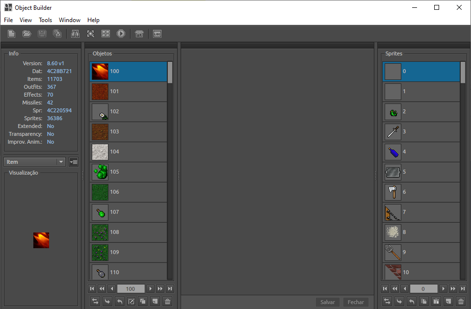
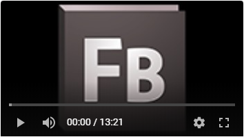

# Object Builder

**Object Builder** is an editor for creating graphic objects for OTClient. You can edit or add new items, outfits, effects or missiles to your client.

<p align="center">
  <br>
  
  <br>
  
  <h5 align="center"><i>Object Builder application</i></h5>
  <br>
</p>

What is Object Builder?
---

Object Builder is an editor for creating graphic objects for [OTClient](https://github.com/edubart/otclient). You can edit or add new items, outfits, effects or missiles to your client.

Some features:

* It's faster to load or compile your projects.
* Import or export your objects as sprite sheet.
* Support for transparent sprites.
* You're able to cut the imported images.

Summary
---

* [Minimal Requirements](minimal-requirements)
* [The Adobe Flash Builder](#the-adobe-flash-builder)
* [The Apache Flex SDK](#the-apache-flex-sdk)
* [The Object Builder](#the-object-builder)
* [Extra](#extra)

---

<p align="center">
  <br>
  <h2 align="center"><i>Tutorial</i></h2>
  <br>
</p>


### Minimal Requirements

* Install the **Adobe AIR**, to be able to execute the application, at [Adobe AIR (click here)](https://get.adobe.com/br/air/)


<p align="center">
  <br>
  
  <h5 align="center"><i>Adobe Flash Builder 4.6</i></h5>
  <br>
</p>

### The Adobe Flash Builder

*How to install*

[](https://www.youtube.com/watch?v=lo48i9tTjM4&list=PLtcK2PuB_49ijcHnqJCXAQr6jGsISO-IF "1. How to install the Adobe Flash Builder")

**1.** Download the parts of `afb.rar`:
> You can find them at [AFB (click here)](./afb), or you can simply just download this whole repository at [ObjectBuilderTutorial-master.zip (click here)](https://github.com/incognitoaccess7/ObjectBuilderTutorial/archive/master.zip)

> [AFB Parts Mirror (click here)](https://drive.google.com/drive/folders/1rZ5eGvAO2RaacCZh2hyoNdMiXgag-fsS)

**2.** Go to Windows 10 security configurations to disable the **Real-time protection** temporarily:
```
  1. `Windows Start Menu`
  2. `Configurations`
  3. `Update & Security`
  4. `Windows Security`
  5. `Virus & threat protection`
  6. At `Virus & threat protection settings`, choose `Manage settings`
  7. At `Real-time protection`, disable it to be able to see the extracted keygen
```
> The Windows will remove the keygen file if this option is enabled

**3.** Extract the parts of `afb.rar` file using the password **AFBv4.6_premium_2011**

**4.** Update your **Flash Player** (it avoids issues with the *Apache Flex SDK*) at:
> [Flash Player (click here)](https://get.adobe.com/flashplayer/)

**5.** Open your `notepad.exe` as **Administrator**

**6.** Open the file `C:\Windows\System32\drivers\etc\hosts` through this notepad (`File > Open...`)

**7.** Add, at the bottom of the file, the following line:
> **127.0.0.1 activate.adobe.com**

**8.** Execute the file `afb/Crack/keygen.exe` as **Administrator**

**9.** Press the button **Patch Hosts File**
> If the error *file already patched.* shows up, ignore it by pressing **OK**

**10.** Choose the option **Adobe Flash Builder v4.5x**

**11.** After generate the serial automatically, copy that

**12.** Enable the Windows **Real-time protection** (*take a look at step 2 for it*)

**13.** Use the generated serial to install the program in the next steps
> While installing it, you don't need to log in or register an Adobe account


<p align="center">
  <br>
  
  <h5 align="center"><i>Flex 4.16.1 + Flash Player 30.0 + AIR SDK 30.0</i></h5>
  <br>
</p>

### The Apache Flex SDK

*How to configure into Adobe Flash Builder*

[](https://www.youtube.com/watch?v=fgyodts9elc&list=PLtcK2PuB_49ijcHnqJCXAQr6jGsISO-IF "2. How to configure the Apache Flex SDK")

**1.** Download the parts of `flex.rar`:
> You can find them at [Apache Flex (click here)](./flex), or you can simply just download this whole repository at [ObjectBuilderTutorial-master.zip (click here)](https://github.com/incognitoaccess7/ObjectBuilderTutorial/archive/master.zip)

> [Apache Flex Parts Mirror (click here)](https://drive.google.com/drive/folders/1gyi-kdn-4m2aeELaYPHs-vKra0xoiPPR)

**2.** Go to `C:\Program Files\Adobe\Adobe Flash Builder 4.6\sdks`, create a folder and name it as **4.16.1**

**3.** Extract the parts of `flex.rar` within this folder using the password **APACHEFLEXv4.16.1**

**4.** Execute the **Adobe Flex Builder**

**5.** Go to `Window > Preferences`

**6.** Then, go to `Flex Builder > Installed Flex SDKs`

**7.** Press **Add...**

**8.** Press **Browse...**

**9.** Press **OK**

**10.** Select **Apache Flex 4.16 1 FP30.0 AIR30.0 en_US**

**11.** Press **OK**


<p align="center">
  <br>
  
  <h5 align="center"><i>Object Builder</i></h5>
  <br>
</p>

### The Object Builder

*How to compile*

[](http://www.youtube.com/watch?v=MrmLxfKuXU4&list=PLtcK2PuB_49ijcHnqJCXAQr6jGsISO-IF "3. How to compile the Object Builder")


**1.** Download the files of `Object Builder`:
> You can find them at [Object Builder (click here)](https://github.com/ottools/ObjectBuilder), or you can simply just download the whole `ObjectBuilder` repository at [ObjectBuilder-master.zip (click here to download)](https://github.com/ottools/ObjectBuilder/archive/master.zip)

> **Note**: *This part of the tutorial is under development, but the video is already done. Then watch the video tutorial instead.*


### Extra

> [Files Mirror (click here)](https://drive.google.com/drive/folders/12offTOjuCcwbN7UkXlHT8uemj8YKXOe9)

> [Video Tutorials (click here)](https://www.youtube.com/playlist?list=PLtcK2PuB_49ijcHnqJCXAQr6jGsISO-IF)
